# Neural Style Transfer
This repository serves as a toned down PyTorch implementation of 'A Neural Algorithm of Artistic Style' by L. Gatys, A. Ecker, and M. Bethge. http://arxiv.org/abs/1508.06576.

Neural Style Transfer allows us to combine the style of an image with the content of a natural image by manipulating the feature representations learned by a Convolutional Neural Network. For example, it can enable us to transfer the style from Vincent van Gogh's The Starry Night to an image of Neckarfront in Tübingen.

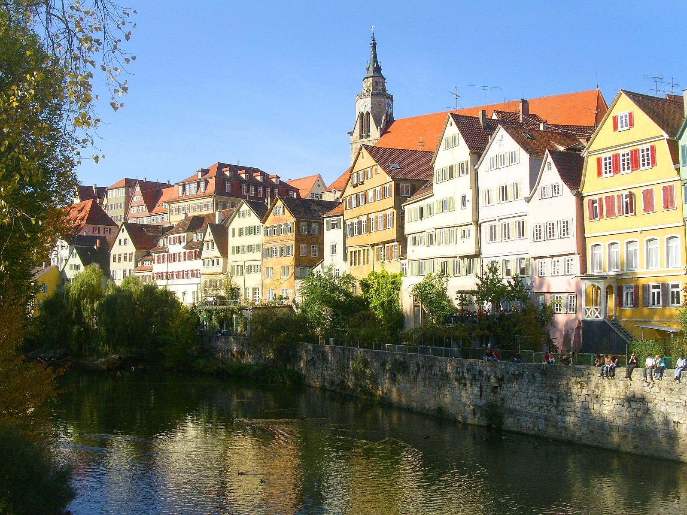

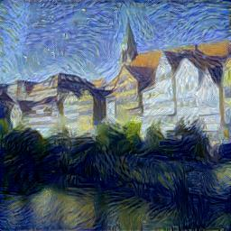

## Content-Style Ratio

We can experiment with the different ratios of content and style in the output image using the content and style loss weights. A higher style loss weight would make the output image resemble more closely to the style image rather than the content image. Here are some examples of two different ratios of content and style losses applied to Neckarfront and four different style images.

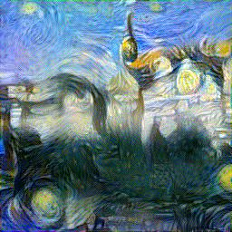

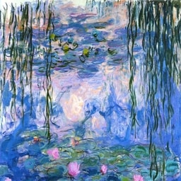
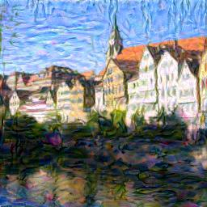
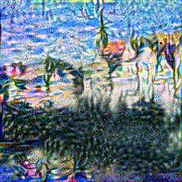

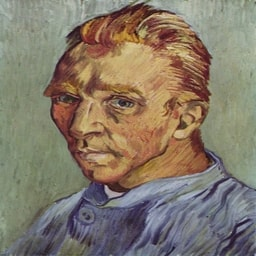
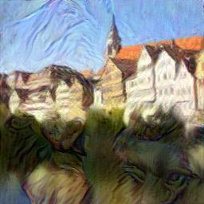
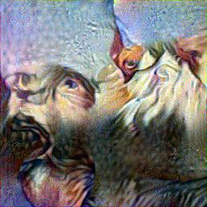

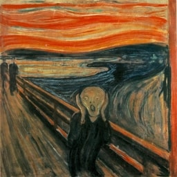
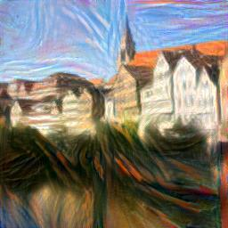
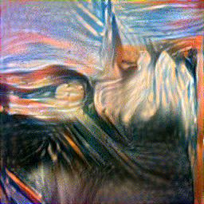

The first column shows the style images, the second column shows the output from the algorithm when the content and style losses are weighted in a balanced fashion and the third column shows the output when the style loss is weighted very high compared to the content weight.

## Implementation

All the images were generated using the Adam optimizer rather than the L-BFGS optimizer used in the original paper due to lack of resources. The content losses were calculated using the `conv4_2` layer of the `vgg19` network and the style losses were calculated using the `conv1_1`, `conv2_1`, `conv3_1`, `conv4_1` and `conv5_1` layers.